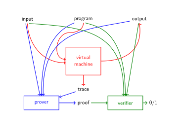

# BrainSTARK, Part 0: Introduction

This tutorial teaches the reader how to design a Turing-complete zk-STARK engine, consisting of a virtual machine, prover, and verifier. Brainfuck was chosen as the target language due to its well-known and simple instruction set, but the design patterns introduced in this tutorial generalize to arbitrary instruction set architectures. The reader should be able to recompile these tools and generate a STARK Engine for a language of their choice with minimal effort. 

## What Are STARKs?

STARKs are one of the most exciting advances in the field of cryptography in recent years. In a nutshell, a STARK engine splits a computation into two parts, the *prover* and the *verifier*. The prover runs the original computation but additionally outputs a string of cryptographic data called the *proof*. The verifier reads this proof and by verifying it he can determine with cryptographic certainty whether the computational claim is correct. The amazing selling point is this: the verifier can check this proof with fewer resources than it takes to run the computation naïvely. Specifically:
 - If the original computation requires inordinate amounts of time or memory, then the verifier is *still* insanely fast. 
 - If the original computation involves secret inputs, the proof can be made *zero-knowledge* meaning that it leaks no information about them, and the verifier can *still* verify it.

The difference between a STARK and a STARK Engine is that the latter comes with a virtual machine and should be capable of proving and verifying arbitrary computations.

 

## Background

This tutorial assumes some familiarity with SNARKs in general, STARKs in particular, and the mathematics involved with the latter. For a more basic introduction please see the [Anatomy of a STARK](https://aszepieniec.github.io/stark-anatomy/) tutorial, or the sources referenced in there. This tutorial builds on the Anatomy in terms of nomenclature, source code, and functionality.

## Roadmap

 - [Part 1: STARK Engine](engine) reviews the essential principles and notions at play in STARKs, presents the overall design and workflow, and introduces concrete tools that will be used.
 - [Part 2: Brainfuck](brainfuck) describes the language that we are building a STARK engine for.
 - [Part 3: Brainfuck-STARK](arithmetization) describes the arithmetization for Brainfuck, and compiles the STARK engine tools developed earlier to build a STARK engine for Brainfuck.
 - [Part 4: Conclusion](next) concludes this tutorial with some thought-provoking perspectives and ideas and suggestions for next steps. 

## Supporting Python Code

The tutorial text contains snippets of python code to illustrate key principles. To see how everything works together as a whole, checkout the [repository](https://github.com/aszepieniec/stark-brainfuck/).

The purpose of this tutorial and the supporting code is educational, and as a result questions about performance are left largely by the wayside. Indeed, for a performant STARK engine you might not want to use python, let alone support Brainfuck.

## Companion

This tutorial has a [companion](https://neptune.cash/learn/brainfuck-tutorial/) written by [Thorkil](https://github.com/Sword-Smith) and [Ferdinand](https://github.com/jan-ferdinand). This sibling is more of a guide to the Brainfuck-STARK codebase rather than a comprehensive answer to the question, how does one produce a STARK engine? The reader might benefit from comparing both sources.

## Acknowledgements

Many thanks go to [Thorkil Værge](https://github.com/Sword-Smith) for helping to debug the codebase, and to him, [Ferdinand Sauer](https://github.com/jan-ferdinand), and [Bobbin Threadbare](https://github.com/bobbinth) for countless useful discussions.

**0** - [1](engine) - [2](brainfuck) - [3](arithmetization) - [4](next)
